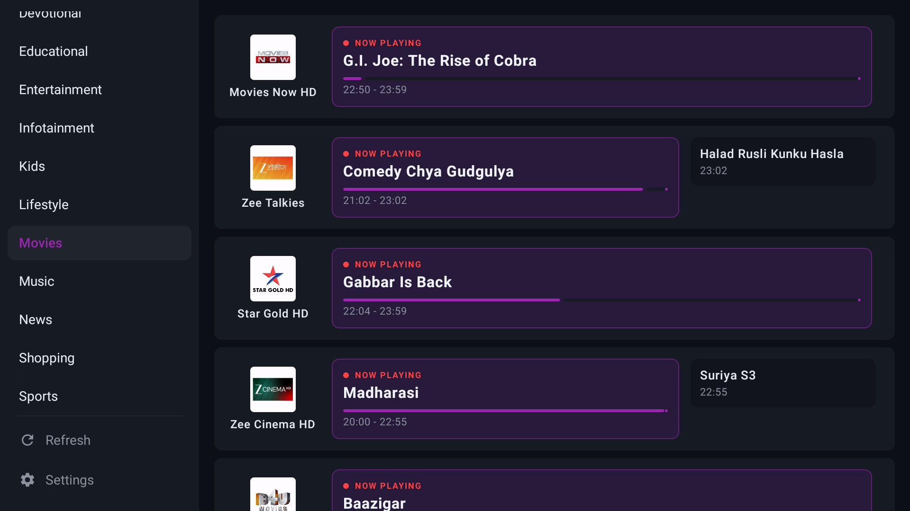
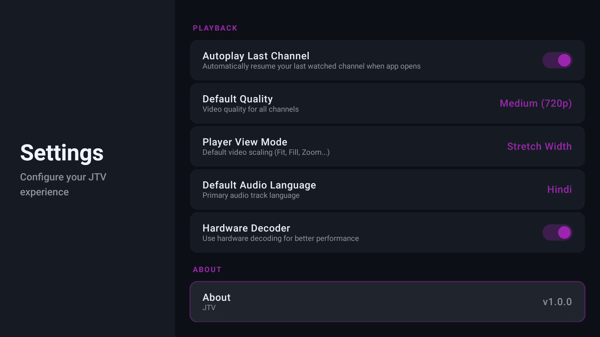
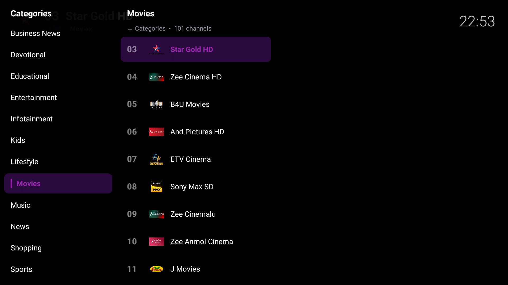
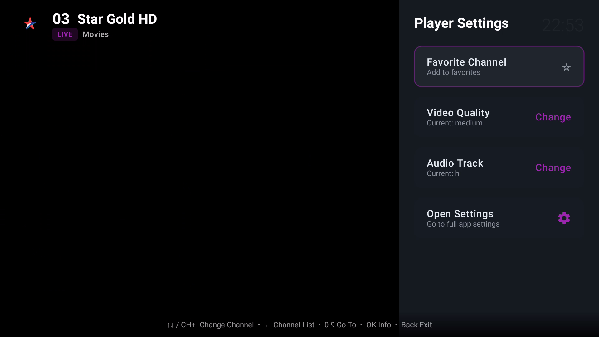

<div align="center">

# 📺 JTV — Live TV for Android TV

**A fast, lightweight, no-nonsense Live TV client built for Android TV & TV boxes.**


[](https://github.com/F-e-n-y-x/JioTV-AndroidTV-/releases/latest)
[](https://github.com/F-e-n-y-x/JioTV-AndroidTV-/releases)

<a href="https://github.com/F-e-n-y-x/JioTV-AndroidTV-/releases/latest">
  
</a>

</div>

---

## ✨ Highlights

- 🎬 **Plays DRM channels** (Star, Sony, Zee, Colors…) with the stream token refreshed in the background, so premium channels don't cut out mid-show.
- ⚡ **Instant startup** — the channel list loads from cache immediately, then refreshes quietly in the background.
- 🛡️ **Built for weak hardware** — hardware decoding, tuned buffers, and smart error recovery keep playback smooth on low-end TVs.
- 🗣️ **Voice Boost** — a built-in dialogue enhancer that lifts speech and lowers background music/effects (great for TVs with poor built-in audio).
- 🎚️ **Real controls** — pick the actual audio track/language, video quality (up to 1080p), aspect ratio, playback buffer, and a sleep timer.
- 📅 **EPG** — optional Electronic Program Guide with a timeline view.
- 🖥️ **Modern TV UI** — Jetpack Compose for TV, on-screen numpad login, and smooth D-pad navigation.

<div align="center">
  
  
  
  
  
  
</div>

---

## 📥 Install

1. **Download** the latest `JTV-vX.X.X.apk` from the [**Releases page**](https://github.com/F-e-n-y-x/JioTV-AndroidTV-/releases/latest).
2. **Sideload** it onto your Android TV with ADB:

   ```bash
   adb connect <YOUR_TV_IP>:5555
   adb install -r JTV-vX.X.X.apk
   ```

   > 💡 Don't have ADB set up? You can also copy the APK to a USB drive and install it with a file-manager app like **"File Commander"** or **"X-plore"** on your TV.

3. **Log in** with your Jio mobile number + OTP using the on-screen numpad.

> ⚠️ Updating from an older build that was signed with a different key? Uninstall first: `adb uninstall com.fenyx.jtv`

---

## 🎮 Remote Controls

| Button | In the channel grid | While watching |
|---|---|---|
| **D-pad ↑ / ↓** | Move | Change channel |
| **CH+ / CH−** | — | Change channel |
| **D-pad ←** | — | Open channel list / categories |
| **D-pad →** | — | Open the player side panel (audio, quality, sleep timer…) |
| **OK / Center** | Open channel | Show/hide channel info |
| **0–9** | — | Jump to a channel number |
| **Back** | Exit app | Close overlay / exit player |

---

## 🔊 Voice Boost (Dialogue Enhancer)

Many channels mix dialogue too quietly under loud music and effects — and most TVs have no fix for it. JTV adds one.

Open the **player side panel** (D-pad **→**) → **Voice Boost** and cycle through **Off → Low → Medium → High → Max**.

It uses center-channel processing to **lift the voice and lower the background** while **keeping the bass full** (so it never sounds thin). **Medium** or **High** is the sweet spot for most content. Pair it with **Auto Volume** to even out loudness between channels.

---

## ⚙️ Settings Overview

| Setting | What it does |
|---|---|
| **EPG Mode** | Switch the home screen to a program-guide timeline |
| **EPG Source URL** | Choose your own XMLTV guide source |
| **Autoplay Last Channel** | Jump straight into your last channel on launch |
| **Default Quality** | Auto / 1080p / 720p / 480p |
| **Playback Buffer** | Data Saver → Max (more buffer = fewer interruptions) |
| **Player View Mode** | Fit, Fill, Zoom, Stretch |
| **Default Audio Language** | Preferred language for multi-audio channels |
| **Hardware Decoder** | Keep **on** for low-end TVs |
| **Tunneling** | Keep **off** unless you have audio-sync issues (can cause black screens on some TVs) |

---

## 🖥️ Companion Server (optional)

A self-hostable **companion server** lets you **log in once and share it across every TV** — plus watch
in a browser and feed any IPTV player. It's a single Docker image (Node + React).

- **One login for all your TVs** — the server stores your Jio login and refreshes tokens centrally.
  Each TV connects with a short access code (**Settings → Sign-in Method → Connect to JTV Proxy
  Server**); you never log in per device, and re-login only ever happens on the server.
- **Web player** — a full JioTV experience in the browser: channel grid, TV guide, **catch-up**,
  favourites and a language filter. Non-DRM channels play over plain HTTP (via hls.js); DRM channels
  play over the server's HTTPS URL.
- **M3U for external players** — generate a playlist (with EPG + catch-up) for **VLC, TiviMate, OTT
  Navigator, Kodi**, filtered by language / category / quality.

```bash
cd server && docker compose up -d --build   # then open http://<host>:8080
```

See **[`server/README.md`](server/README.md)** for full setup, the API, and details.

---

## 🛠️ Building from Source

**Requirements:** Android Studio (or the command-line SDK) with JDK 17+.

```bash
git clone https://github.com/F-e-n-y-x/JioTV-AndroidTV-.git
cd JioTV-AndroidTV-
./gradlew assembleDebug
```

The debug APK is written to `app/build/outputs/apk/debug/app-debug.apk`.

<details>
<summary><b>Release builds (signed)</b></summary>

Create a `keystore.properties` file in the project root (it's gitignored):

```properties
storeFile=jtv-release.keystore
storePassword=YOUR_STORE_PASSWORD
keyAlias=YOUR_ALIAS
keyPassword=YOUR_KEY_PASSWORD
```

Generate a keystore once:

```bash
keytool -genkeypair -v -keystore jtv-release.keystore -alias jtv -keyalg RSA -keysize 2048 -validity 10000
```

Then build the signed, minified release (~3–4 MB):

```bash
./gradlew assembleRelease
```

</details>

---

## 🧱 Tech Stack

| Area | Technology |
|---|---|
| **UI** | Jetpack Compose for TV (Material 3) |
| **Media** | AndroidX Media3 / ExoPlayer (HLS + DASH/Widevine) |
| **Architecture** | MVVM · Kotlin Coroutines · StateFlow |
| **Navigation** | AndroidX Navigation 3 |
| **Storage** | DataStore Preferences + on-disk cache |
| **Images** | Coil |

---

## 📝 Changelog

### v1.5.1
- **Video quality now actually follows your setting.** Picking **High (1080p)** used to be a *ceiling*
  only, so playback still began on Jio's lowest rendition (as low as 320×180) and slowly crept up. The
  chosen quality is now a **floor as well as a ceiling**, and the player starts on the top rendition
  immediately instead of ramping. *(Verified on-device: 1080p @2.3 Mbps selected from the first segment.)*
- **Faster channel zaps on DRM channels** — playback no longer blocks on the Widevine license round-trip
  before rendering.
- **Lighter playback loop** on weak TV CPUs (Media3 1.11 dynamic scheduling).
- Toolchain/library currency: Kotlin 2.4.0 · Gradle 9.6.1 · AGP 9.2.1 · Compose 2026.06.01 ·
  Navigation3 1.1.4 · DataStore 1.2.1 · Coroutines 1.11.0 · core-ktx 1.19.0.

### v1.5.0
- **Platform modernization** — updated the build toolchain and core libraries: AGP 9.2 · Gradle 9.4.1 ·
  Kotlin 2.3.21 · Jetpack Compose 2026.06 · **AndroidX Media3 1.11** · Lifecycle 2.11 · Coil 2.7
  (`compileSdk 37`; `minSdk`/`targetSdk` unchanged).
- **Baseline Profile groundwork** — added a `:baselineprofile` module + ProfileInstaller so a
  generated launch→browse→play profile can be embedded for faster cold start on low-end TV boxes.
- **Tests** — added unit tests for stream-token extraction/expiry and EPG timestamp parsing.
- **Cleanup** — removed unused settings keys and a stale dependency entry.

### v1.4.0
- **Companion server** (self-hostable, Docker): log in once and share it across every TV, a full
  **browser web player** (channel grid, TV guide, catch-up, favourites, language filter), and an
  **M3U playlist generator** for external IPTV players (VLC/TiviMate/OTT Navigator) with EPG + catch-up.
- Non-DRM channels now **play in the browser over plain HTTP** (hls.js + server-side AES-key handling);
  DRM channels play over the server's HTTPS URL.
- **App:** fixed token auto-refresh (captures the refresh token at login and calls the refresh endpoint
  correctly), so the app recovers stale sessions on its own.

### v1.3.2
- Reworked **Voice Boost** into a 5-level dialogue enhancer (center-channel processing) with **bass preserved** and a presence boost for clarity — no more thin/hollow sound. The old "Reduce Background" toggle is merged in.

### v1.3
- In-player **audio controls** (Voice Boost, Auto Volume), a **real audio-track/language selector**, the current channel is kept when opening Settings, and the player side panel now scrolls.

### v1.2
- **DRM channels no longer cut out every ~2 minutes** (transparent stream-token refresh), fixed release-build crashes, off-by-default tunneling, smoother buffering, instant cached startup, app-icon fix, and `targetSdk 36`.

See the [Releases page](https://github.com/F-e-n-y-x/JioTV-AndroidTV-/releases) for full notes and downloads.

---

## 🙏 Credits

Built with reference to and inspiration from:

- [dineshintry/plugin.kodi.jiotv](https://github.com/dineshintry/plugin.kodi.jiotv)
- [JioTV-Go/jiotv_go](https://github.com/JioTV-Go/jiotv_go)

---

## ⚖️ Disclaimer

This is an independent, third-party Android TV client made for **educational purposes**. It is **not** affiliated with, authorized, maintained, or endorsed by JioTV or Reliance Jio Infocomm Ltd. You are responsible for how you use it, and you need a valid Jio account to log in. Use at your own risk.
